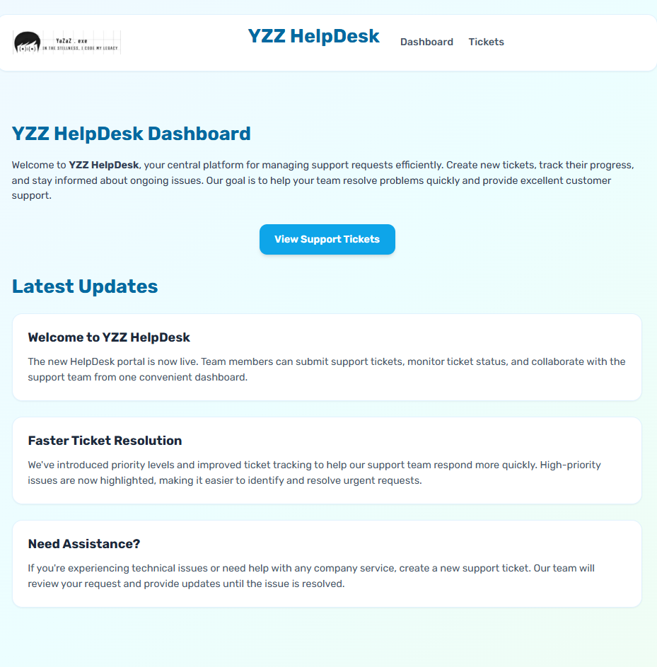
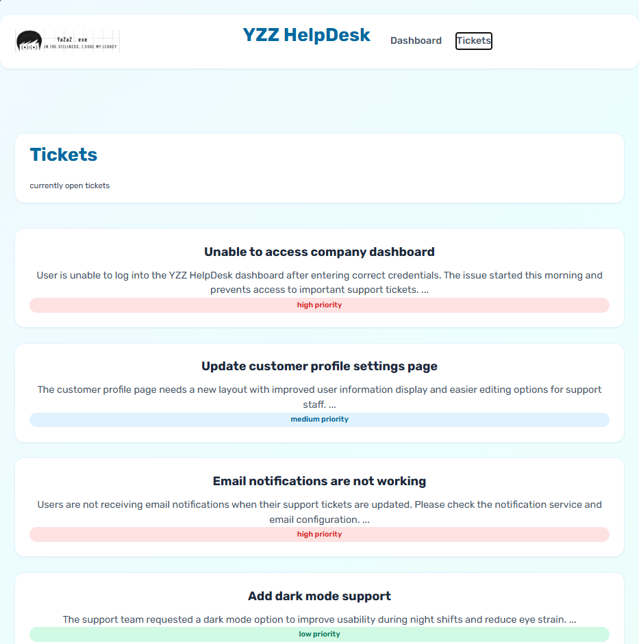
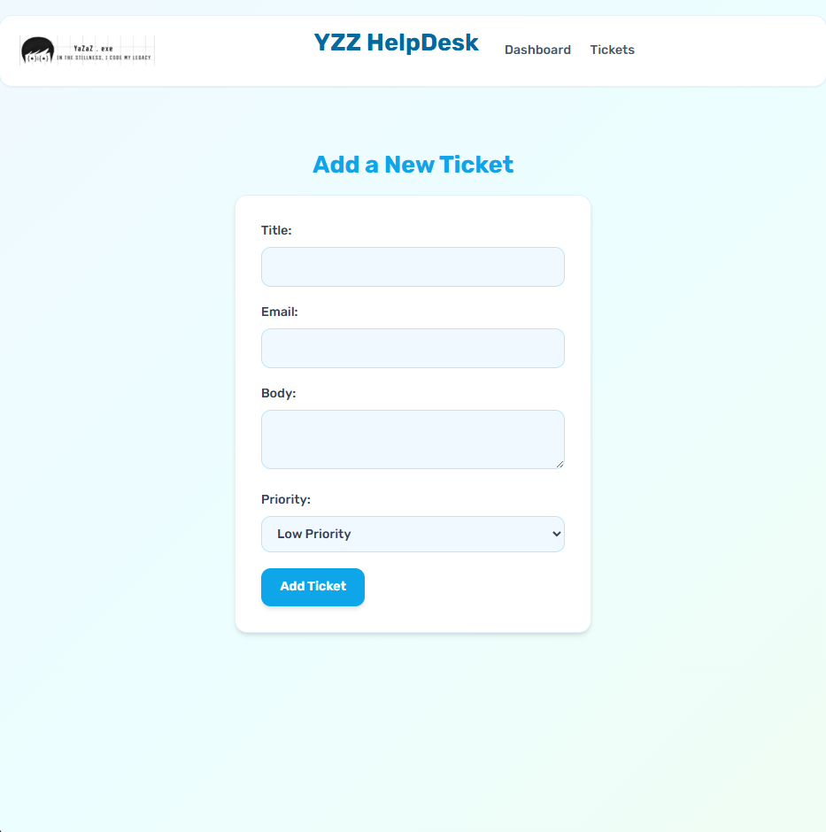

# YZZ HelpDesk 🚀

A modern HelpDesk ticket management application built with **Next.js**, **React**, **Tailwind CSS**, and **JSON Server**.

YZZ HelpDesk helps users view support tickets, check ticket details, and manage support requests through a clean and responsive dashboard.

---

## ✨ Features

- 📋 View all support tickets
- 🎫 View individual ticket details
- ⚡ Next.js App Router dynamic routing
- 🎨 Custom UI with Tailwind CSS
- 🔄 Fetch ticket data using JSON Server
- 🚀 Static generation with `generateStaticParams`
- ♻️ Incremental Static Regeneration (ISR)
- 🛑 Custom 404 handling with `notFound()`
- 🧩 Reusable React components
- 📱 Responsive layout

---

## 🛠️ Technologies Used

- Next.js
- React
- Tailwind CSS
- JavaScript (ES6+)
- JSON Server

---

## 📂 Project Structure

```
yzz-helpdesk/
│
├── app/
│   ├── components/
│   │   ├── Navbar.jsx
│   │   └── Logo.png
│   │
│   ├── tickets/
│   │   ├── page.jsx
│   │   └── [id]/
│   │       └── page.jsx
│   │
│   ├── globals.css
│   ├── layout.jsx
│   └── page.jsx
│
├── _data/
│   └── db.json
│
├── package.json
├── tailwind.config.js
└── next.config.js
```

---

# ⚙️ Installation

## 1. Clone the repository

```bash
git clone https://github.com/HAMYL-Aththnayaka/yzz-helpDesk.git
```

## 2. Navigate to the project folder

```bash
cd yzz-helpdesk_next_js_totorial
```

## 3. Install dependencies

```bash
npm install
```

---

# ▶️ Running the Application

Start the Next.js development server:

```bash
npm run dev
```

Open:

```
http://localhost:3000
```

---

# 🗄️ Running JSON Server API

Install JSON Server:

```bash
npm install json-server -g
```

Start the API server:

```bash
json-server --watch --port 4000 ./_data/db.json
```

API endpoint:

```
http://localhost:4000/tickets
```

---

# 🌐 Routes

| Route | Description |
|---|---|
| `/` | Dashboard |
| `/tickets` | Ticket list |
| `/tickets/[id]` | Ticket details |

Example:

```
/tickets/1
```

---

# 📦 Ticket Data Example

```json
{
  "id": "1",
  "title": "Unable to access company dashboard",
  "body": "User is unable to log into the dashboard.",
  "priority": "high",
  "user_email": "alex.johnson@yzz.com"
}
```

---

# ⚡ Next.js Concepts Used

## Dynamic Routes

Ticket details pages are created using:

```
app/tickets/[id]/page.jsx
```

The `[id]` folder creates dynamic pages automatically.

---

## Server Components

Data fetching is performed inside async server components:

```javascript
const ticket = await get_Ticket_data(id);
```

---

## Static Generation

Using:

```javascript
generateStaticParams()
```

to pre-generate ticket pages.

---

## Incremental Static Regeneration

Using:

```javascript
next: {
  revalidate: 60
}
```

to refresh cached data automatically.

---

# 📸 Screenshots

## Dashboard

<!-- Add dashboard screenshot here -->





## Ticket List

<!-- Add tickets page screenshot here -->


## Ticket Details

<!-- Add ticket details screenshot here -->


---

# 🎨 UI Theme

The application includes:

- Light purple and blue color theme
- Clean HelpDesk dashboard design
- Ticket cards with priority labels
- Responsive navigation
- Modern user interface

---

# 👨‍💻 Author

**HAMYL Aththnayaka**

GitHub:

https://github.com/HAMYL-Aththnayaka

---

# 📜 License

This project is created for learning and educational purposes.